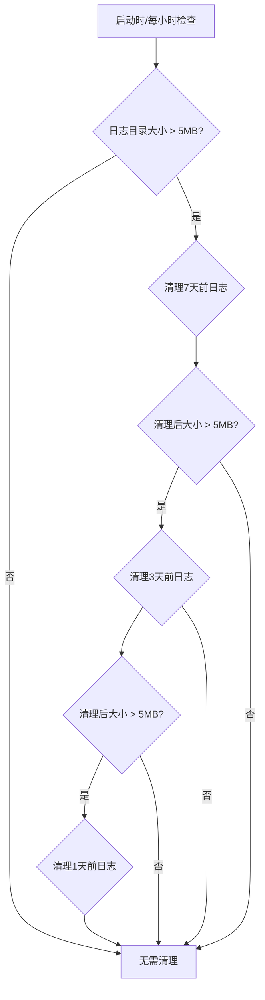

## 当前日志系统分析

基于我的分析，当前项目的日志系统具有以下特点：

### 现状
1. **输出位置**：仅输出到控制台（stdout）
2. **格式**：结构化JSON格式，包含时间戳、级别、消息、请求ID等
3. **功能**：支持请求ID跟踪、异常记录、模型事件记录
4. **配置**：通过环境变量 `EMB_PROVIDER_LOG_LEVEL` 控制日志级别

### 不足
1. 没有文件输出功能
2. 没有日志轮转和大小控制
3. 没有自动清理旧日志功能
4. 没有按日志级别分割文件

## 扩展日志系统架构设计

根据您的需求，我设计了以下扩展方案：

### 1. 日志文件结构
```
logs/
├── app-2025-11-09-debug.log
├── app-2025-11-09-info.log
├── app-2025-11-09-warning.log
├── app-2025-11-09-error.log
└── cleanup.log  # 记录清理操作
```

### 2. 核心功能模块

#### A. 配置扩展
- 日志文件输出开关
- 日志目录路径配置
- 单个文件最大大小（10MB）
- 默认保留天数（7天）
- 动态清理策略（7天→3天→1天）
- 检查间隔（1小时）

#### B. 日志管理器
- 文件处理器管理
- 按级别创建不同文件处理器
- 日志轮转控制
- 定期清理任务

#### C. 清理策略


### 3. 技术实现方案

#### A. 使用Python标准库
- `logging.handlers.RotatingFileHandler`：处理文件轮转
- `logging.handlers.TimedRotatingFileHandler`：按时间轮转
- `apscheduler`：定时任务调度
- `pathlib`：文件系统操作

#### B. 日志处理器配置
- 每个日志级别（DEBUG, INFO, WARNING, ERROR）独立的文件处理器
- 控制台处理器保持不变（用于开发和调试）
- 文件处理器使用JSON格式保持一致性

#### C. 清理算法
1. 计算日志目录总大小
2. 如果超过5MB，按保留天数策略清理
3. 逐步降低保留天数：7天→3天→1天
4. 记录清理操作到专门的日志文件

### 4. 配置参数设计

```python
# 新增配置参数
log_to_file: bool = True  # 是否启用文件日志
log_dir: str = "logs"  # 日志目录
log_file_max_size: int = 10  # 单个文件最大大小(MB)
log_retention_days: int = 7  # 默认保留天数
log_cleanup_interval_hours: int = 1  # 清理检查间隔(小时)
log_max_dir_size_mb: int = 5  # 清理后目录最大大小(MB)【否则尝试清理更近的日志】
log_cleanup_retention_days: List[int] = [7, 3, 1]  # 清理策略
```

### 5. 实现步骤

1. **扩展配置模型**：添加日志文件相关配置参数
2. **创建日志管理器**：实现文件处理器和清理逻辑
3. **更新setup_logging函数**：集成文件输出功能
4. **实现清理任务**：添加定时清理和启动时清理
5. **更新环境变量**：添加新的配置选项
6. **编写测试**：确保功能正确性
7. **更新文档**：说明新功能使用方法
