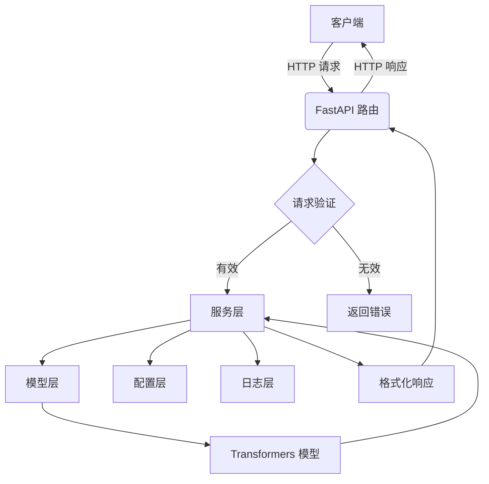

# 设计文档：OpenAI 兼容的嵌入模型 API

## 环境与项目结构

### 开发环境
- **Python 版本**: 3.10
- **包管理器**: uv
- **核心依赖**:
  - `numpy>=2.2.0`
  - `torch>=2.9.0`
  - `transformers`
  - `fastapi`
  - `pydantic`
  - `uvicorn`

### 项目结构
```
d:/Source/torch/
├── pyproject.toml          # 项目依赖和配置
├── emb_model_provider/     # 主要代码目录
│   ├── __init__.py
│   ├── main.py            # FastAPI 应用入口
│   ├── api/               # API 路由
│   │   ├── __init__.py
│   │   └── v1/
│   │       ├── __init__.py
│   │       ├── embeddings.py
│   │       └── models.py
│   ├── core/              # 核心业务逻辑
│   │   ├── __init__.py
│   │   ├── config.py
│   │   ├── logging.py
│   │   └── model_manager.py
│   └── services/          # 服务层
│       ├── __init__.py
│       └── embedding_service.py
└── specs/                 # 设计和需求文档
    └── embedding_api/
        ├── requirements.md
        ├── design.md
        └── tasks.md
```

### 依赖管理
项目依赖将通过 `pyproject.toml` 文件进行管理，使用 `uv` 作为包管理器。所有依赖版本将使用 `>=` 形式指定，以确保兼容性。

## 概述

本设计文档描述了一个基于 FastAPI 的嵌入服务，该服务使用 `transformers` 库加载 `all-MiniLM-L12-v2` 模型，并提供与 OpenAI API 兼容的 `/v1/embeddings` 和 `/v1/models` 端点。该服务将部署在 `localhost:9000`，并包含一个管理模块用于配置资源使用和日志记录。

## 架构

系统将采用分层架构，主要包含以下组件：

1. **API 层**：使用 FastAPI 实现，处理 HTTP 请求和响应。
2. **服务层**：包含核心业务逻辑，如模型推理和请求验证。
3. **模型层**：负责加载和管理 `all-MiniLM-L12-v2` 模型。
4. **配置层**：管理服务配置，如批处理大小、上下文长度和日志级别。
5. **日志层**：提供结构化日志记录功能。



## 组件与接口

### 1. API 路由

#### `/v1/models`
- **方法**: `GET`
- **描述**: 列出可用的模型。
- **响应**: 一个包含模型对象的列表，每个对象包含 `id`, `object`, `created`, `owned_by` 字段。

#### `/v1/embeddings`
- **方法**: `POST`
- **描述**: 为给定的输入文本创建嵌入向量。
- **请求体**:
  - `input` (string 或 array): 要嵌入的输入文本。
  - `model` (string): 要使用的模型 ID。
  - `encoding_format` (string, 可选): 嵌入的格式，`float` 或 `base64`。
  - `user` (string, 可选): 代表最终用户的唯一标识符。
- **响应**: 一个包含嵌入对象的列表，以及 `model` 和 `usage` 信息。

### 2. Pydantic 模型

#### 请求模型
```python
class EmbeddingRequest(BaseModel):
    input: Union[str, List[str]]
    model: str
    encoding_format: Optional[str] = "float"
    user: Optional[str] = None
```

#### 响应模型
```python
class EmbeddingData(BaseModel):
    object: str = "embedding"
    embedding: List[float]
    index: int

class Usage(BaseModel):
    prompt_tokens: int
    total_tokens: int

class EmbeddingResponse(BaseModel):
    object: str = "list"
    data: List[EmbeddingData]
    model: str
    usage: Usage

class ModelInfo(BaseModel):
    id: str
    object: str = "model"
    created: int
    owned_by: str

class ModelsResponse(BaseModel):
    object: str = "list"
    data: List[ModelInfo]
```

### 3. 服务层

#### `EmbeddingService`
- `load_model()`: 从本地路径或 Hugging Face Hub 加载模型。
- `generate_embeddings(inputs: List[str])`: 生成嵌入向量。
- `validate_request(request: EmbeddingRequest)`: 验证请求参数。

#### `ConfigService`
- `get_config()`: 获取当前配置。
- `update_config(new_config: dict)`: 更新配置。

### 4. 模型层

#### `ModelManager`
- `__init__(model_path: str)`: 初始化模型管理器。
- `_load_local_model()`: 从本地路径加载模型。
- `_download_model()`: 从 Hugging Face Hub 下载模型。
- `model`: 属性，返回加载的模型实例。
- `tokenizer`: 属性，返回加载的 tokenizer 实例。

## 数据模型

### 配置数据
```python
class Config(BaseModel):
    max_batch_size: int = 32
    max_context_length: int = 512  # all-MiniLM-L12-v2 supports up to 512 tokens
    embedding_dimension: int = 384  # all-MiniLM-L12-v2 produces 384-dimensional embeddings
    memory_limit: str = "2GB"
    log_level: str = "INFO"
    model_path: str = "D:\\models\\all-MiniLM-L12-v2"
```

### 日志数据
日志将以 JSON 格式输出到标准输出，包含以下字段：
- `timestamp`: ISO 8601 格式的时间戳。
- `level`: 日志级别 (DEBUG, INFO, WARNING, ERROR)。
- `message`: 日志消息。
- `request_id`: 请求的唯一标识符（如果适用）。
- `details`: 额外的详细信息（仅在 DEBUG 级别包含）。

## 错误处理

系统将实现全面的错误处理机制，确保所有错误都遵循 OpenAI API 的响应格式。

### 错误类型与 HTTP 状态码

1. **验证错误** (`400 Bad Request`):
   - 请求体格式错误
   - 必需参数缺失
   - 参数类型错误

2. **资源限制错误** (`429 Too Many Requests`):
   - 输入文本超出最大上下文长度 (默认 512 tokens)
   - 请求数量超出最大批处理大小 (默认 32)
   - 内存使用超出配置限制

3. **模型错误** (`500 Internal Server Error`):
   - 模型加载失败
   - 模型推理过程中出错
   - 模型文件损坏或不存在

4. **配置错误** (`500 Internal Server Error`):
   - 配置文件格式错误
   - 环境变量设置无效

5. **内部服务器错误** (`500 Internal Server Error`):
   - 未预期的系统错误
   - 数据库连接失败（如果使用）

### 错误响应格式

所有错误响应都将遵循 OpenAI API 的格式：
```json
{
  "error": {
    "message": "错误描述",
    "type": "invalid_request_error",
    "param": "input",
    "code": null
  }
}
```

### 具体错误场景

#### 上下文长度超出限制
- **错误类型**: `invalid_request_error`
- **HTTP 状态码**: `429 Too Many Requests`
- **错误消息**: "This model's maximum context length is 512 tokens. However, your messages resulted in 600 tokens."
- **参数**: `input`

#### 批处理大小超出限制
- **错误类型**: `invalid_request_error`
- **HTTP 状态码**: `429 Too Many Requests`
- **错误消息**: "Maximum batch size is 32. However, your request contains 40 inputs."
- **参数**: `input`

#### 模型不存在
- **错误类型**: `invalid_request_error`
- **HTTP 状态码**: `404 Not Found`
- **错误消息**: "Model 'all-MiniLM-L12-v2' not found."
- **参数**: `model`

#### 空输入
- **错误类型**: `invalid_request_error`
- **HTTP 状态码**: `400 Bad Request`
- **错误消息**: "Input cannot be empty."
- **参数**: `input`

### 错误处理实现

#### 自定义异常类
```python
class EmbeddingAPIError(Exception):
    def __init__(self, message: str, error_type: str, param: str = None, code: str = None):
        self.message = message
        self.type = error_type
        self.param = param
        self.code = code

class ContextLengthExceededError(EmbeddingAPIError):
    def __init__(self, max_length: int, actual_length: int):
        super().__init__(
            message=f"This model's maximum context length is {max_length} tokens. However, your messages resulted in {actual_length} tokens.",
            error_type="invalid_request_error",
            param="input"
        )

class BatchSizeExceededError(EmbeddingAPIError):
    def __init__(self, max_size: int, actual_size: int):
        super().__init__(
            message=f"Maximum batch size is {max_size}. However, your request contains {actual_size} inputs.",
            error_type="invalid_request_error",
            param="input"
        )
```

#### 全局异常处理器
```python
from fastapi import Request, HTTPException
from fastapi.responses import JSONResponse

async def embedding_api_exception_handler(request: Request, exc: EmbeddingAPIError):
    return JSONResponse(
        status_code=400,
        content={
            "error": {
                "message": exc.message,
                "type": exc.type,
                "param": exc.param,
                "code": exc.code
            }
        }
    )
```

## 测试策略

1. **单元测试**: 测试各个组件的功能，如模型加载、请求验证和配置管理。
2. **集成测试**: 测试 API 端点的完整流程，包括请求和响应。
3. **性能测试**: 测试服务在高并发下的性能和资源使用情况。
4. **兼容性测试**: 验证 API 与 OpenAI 客户端库的兼容性。

## 设计决策与理由

1. **使用 FastAPI**: FastAPI 提供高性能、自动文档生成和类型提示，非常适合构建现代 API。
2. **使用 Transformers**: Transformers 是 Hugging Face 提供的成熟库，支持广泛的预训练模型。
3. **本地模型优先**: 优先从本地路径加载模型，避免重复下载，提高启动速度。
4. **结构化日志**: JSON 格式的日志便于与日志聚合系统集成，并支持容器化部署。
5. **配置驱动**: 通过配置文件或环境变量管理服务参数，提高灵活性和可维护性。